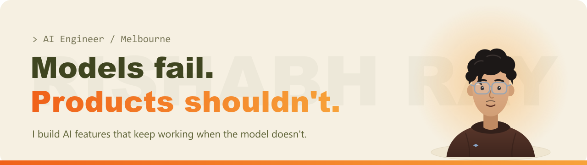

  
  
  

### Hi, I'm Rishabh

AI Engineer in Melbourne with a Master of Artificial Intelligence from Monash University. I build AI features that keep working when the model doesn't: a deterministic core that always answers, a model on top that improves the answer, and fallbacks for every way it can fail.

Right now I mentor student software teams at Monash and build RAY/OS, my own AI operating system.

## Featured work

<table>
  <tr>
    <td width="50%" valign="top">
      <h3><a href="https://github.com/rishabhrayy/neighbourfit">NeighbourFit</a></h3>
      Expo winner, Monash PG Industry Experience 2026
      
Melbourne suburb recommender. Deterministic scoring ranks 290+ suburbs first, Llama 3.3 re-ranks, summarises and reads voice input, with enforced JSON and graceful fallbacks.

      
<a href="https://rishabhray.vercel.app/projects/neighbourfit"><b>Case study</b></a> · <a href="https://github.com/rishabhrayy/neighbourfit">Docs</a>

      Vue 3 · Flask · AWS Lambda · PostgreSQL · Llama 3.3
    </td>
    <td width="50%" valign="top">
      <h3><a href="https://github.com/rishabhrayy/outfit-picker">Outfit Picker</a></h3>
      Solo, shipped
      
Local-first PWA wardrobe. Swap OpenAI, Claude, Gemini or Groq at runtime behind one interface, with a fallback ladder for structured output. Photos and keys never leave the device.

      
<a href="https://rishabhray-outfit-picker.vercel.app"><b>Live demo</b></a> · <a href="https://github.com/rishabhrayy/outfit-picker">Code</a>

      React · Vite · IndexedDB · PWA
    </td>
  </tr>
  <tr>
    <td width="50%" valign="top">
      <h3><a href="https://github.com/rishabhrayy/monash-projects">AI Systems, from first principles</a></h3>
      Master of AI coursework
      
Four cooperating DQN agents trained from scratch, optimisers written by hand on raw tensors, KNN with a KDTree, and a Pacman team that tracks hidden opponents with a particle filter.

      
<a href="https://github.com/rishabhrayy/monash-projects"><b>Code</b></a>

      Python · PyTorch · NumPy
    </td>
    <td width="50%" valign="top">
      <h3><a href="https://rishabhray.vercel.app/#rayos">RAY/OS</a></h3>
      Personal, running daily
      
My second brain on Claude and an Obsidian vault: a pipeline for notes, skills that encode how I work, scheduled agents, and a voice console I can reach from my phone. It drafts. I decide.

      
<a href="https://rishabhray.vercel.app/#rayos"><b>How it works</b></a>

      Claude · Obsidian · Python · Flask · MCP
    </td>
  </tr>
</table>

## Stack

  
  
  
  
  
  
  
  
  
  
  
  

## Play in your browser

| Project | What it does | |
|---|---|---|
| [Melbourne house prices](https://github.com/rishabhrayy/property-predictor) | XGBoost with an 80% price range, running entirely in the browser. 10.3% median error on sales it never saw. | [**Try it**](https://rishabhray-property.vercel.app) |
| [Movie recommender](https://github.com/rishabhrayy/movie-recommender) | Pick a film, get five that share its cast, director, genre or plot, with the reason for each. | [**Try it**](https://rishabhray-movies.vercel.app) |
| [Snake](https://github.com/rishabhrayy/snake-game) | Pygame compiled to WebAssembly, so the desktop game plays in the browser. Swipe on a phone. | [**Play**](https://rishabhray-snake.vercel.app) |

Full work rights in Australia to August 2029, no sponsorship required.
